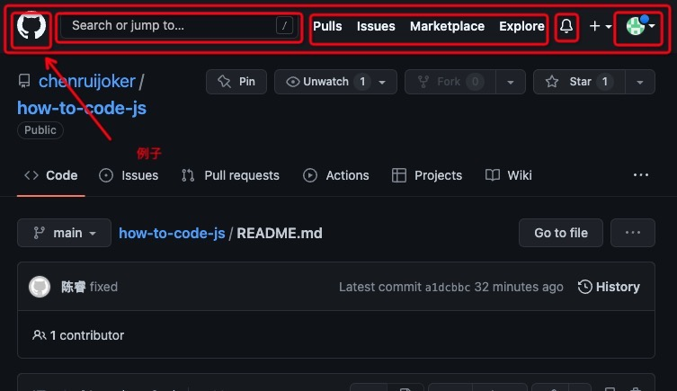

# 如何声明变量

说白了前端三板斧：`html`、`js`、`css`,`html` 内容比较少，更多是`css`和`js`的变量声明。

**本文目录**

-   [html 标签或组件标签使用技巧]()
-   [声明 css、scss or less 变量](#声明-cssscss-变量)
-   声明 js 变量
    -   声明基本变量
    -   声明 API 函数变量
    -   声明普通函数变量
-   声明 React 组件

---

## html 标签或组件标签使用技巧

不论是组件还是正常的 html 标签，说是标签内容里面没有内容我们一律使用`自闭包`写法，目的也很简单，代码更加简洁，一下子也能判断你的组件是否支持 `内部嵌套` 之类的情况

```html
<div>
    
    <!-- 下面的写法避免写 -->
    <!-- </img> -->
</div>
```

## 声明 css、scss or less 变量

这里以 github 网页为例子



一般而言，我们会更根据业务用途、布局关系来进行样式变量的声明，以该图为例，首先一这是一整个顶部 header，里面有头像,搜索框，操作导航，消息提示，github 的 logo，所以这个部分的样式渲染应该是写成这样

`小写-小写`风格

```html
<div class="top-header">
    
    <input class="search-input-bar" />
    <div class="navigation-bar">
        <button class="navigation-button">Pulls</button>
        <button class="navigation-button">Issues</button>
        <button class="navigation-button">Marketplace</button>
        <button class="navigation-button">Explore</button>
    </div>
    
    
</div>
```

至于某一些场景中我们会在头部中有两个 search 框，那也可以考虑按照位置去命名，比如`left-search-bar` 或者 `right-search-bar`

另外像是 scss 或者 less 这种预编译语法我们最好还是在组件最外层去声明一个变量，然后组件里面的 class 命名就全都包裹进里面,这样的好处也是避免了样式污染

`scss-example`

```scss
.top-header {
    .github-logo {
    }
    .search-input-bar {
    }
    .navigation-bar {
        .navigation-button {
        }
        // 由于这个button的样式是针对navigation独有的，所以甚至可以直接不需要navigation-button而直接使用 button
    }
    .message-bell {
    }
    .avatar {
    }
}
```
